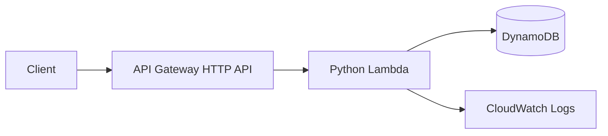

# Serverless Incident API

A production-minded REST API for recording and tracking operational incidents without managing servers. The project demonstrates API design, Infrastructure as Code, least-privilege IAM, automated testing, observability, and cost-aware AWS architecture.

## Architecture



## Features

- Create, list, retrieve, update, and close incidents
- DynamoDB on-demand capacity and automatic expiry support
- Structured JSON responses and input validation
- Terraform-managed infrastructure
- CloudWatch logging with configurable retention
- Python unit tests and GitHub Actions CI
- No secrets committed to source control

## API

| Method | Path | Purpose |
|---|---|---|
| `POST` | `/incidents` | Create an incident |
| `GET` | `/incidents` | List incidents |
| `GET` | `/incidents/{id}` | Retrieve an incident |
| `PATCH` | `/incidents/{id}` | Update status or severity |

Example request:

```json
{
  "title": "Checkout latency increased",
  "severity": "SEV2",
  "service": "checkout-api"
}
```

## Local validation

```bash
python -m unittest discover -s tests -v
terraform -chdir=infra fmt -check
terraform -chdir=infra validate
```

## Deployment

1. Configure AWS credentials with a least-privilege deployment role.
2. Run `terraform -chdir=infra init`.
3. Review `terraform -chdir=infra plan`.
4. Deploy with `terraform -chdir=infra apply`.
5. Use the `api_endpoint` output to call the API.

## Free-tier and teardown

The design uses Lambda, API Gateway, DynamoDB on-demand capacity, and short CloudWatch log retention. Usage can still create charges if free-tier limits are exceeded. Set an AWS Budget before deployment and remove everything afterward:

```bash
terraform -chdir=infra destroy
```

## Skills demonstrated

AWS Lambda, API Gateway, DynamoDB, CloudWatch, Terraform, Python, IAM, REST APIs, CI/CD, testing, and operational documentation.
